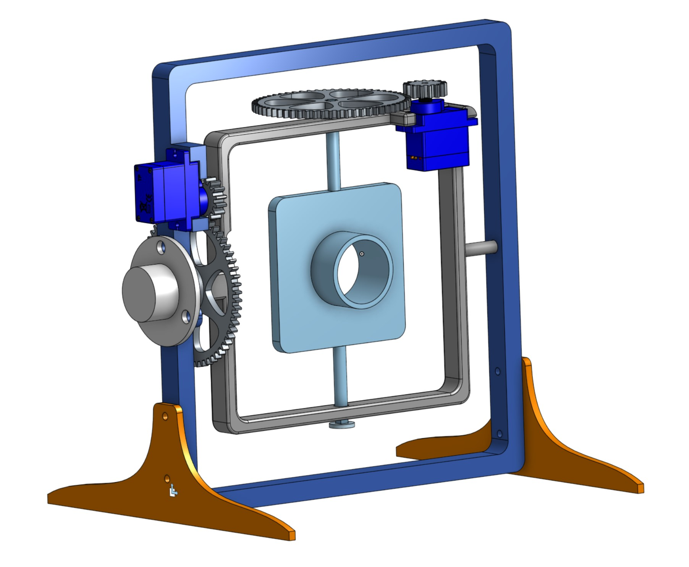
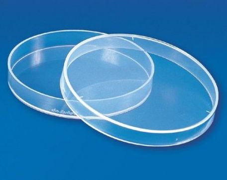

# Core Electronics Random Positioning Machine

Designed by [Core Electronics](https://core-electronics.com.au/) with documentation created and delivered by [Unconvengineering](unconvengineering.au)

## Assembly Instructions

A full bill of materials and assembly steps are covered in the instructions <a href="Assembly Instructions - Random Positioning Machine.pdf">.pdf</a>, <a href="Assembly Instructions - Random Positioning Machine.docx">.docx</a>

 [.docx]("Assembly Instructions - Random Positioning Machine.docx")

## OnShape Projects
This project was designed in OnShape - while all the files are available for download in this repo, we've also linked the origin project so you can
fork and modify as you see fit.

- [Gimbal Assembly](https://cad.onshape.com/documents/117125a5cf84acec012e1a52/w/c55d24c53f2760a36eea97f8/e/02a9edc0bc610c3cdac462cd?renderMode=0&uiState=64db2ebd76c08d0898801432)
- [Gear (small)](https://cad.onshape.com/documents/63b473fbdfe0cbb39b024efd/w/53a67950cdeedfac31a50e38/e/d05ef7a5c43a5f8707287d7b?renderMode=0&uiState=64db2f5d380afe075d66f8b1)
- [Gear (large, outer)](https://cad.onshape.com/documents/dbe6b9c073808e8914625170/w/710d424163e9eedf6311d957/e/28fb5d510d10226144798958?renderMode=0&uiState=64db2f33380afe075d66f8a0)
- [Gear (large, inner)](https://cad.onshape.com/documents/dbe6b9c073808e8914625170/w/710d424163e9eedf6311d957/e/28fb5d510d10226144798958?renderMode=0&uiState=64db2f33380afe075d66f8a0)

## Lab Supplies

The Random Positioning Machine is designed to be compatible with the following products. The 25mm tube is a tight fit in the experiment platform hole, or the petri dish can be adhered to the flat side of the platform.

 

- Culture Media Tube - 25x100mm | Science Equip SKU:[16.00.011420](https://www.scienceequip.com.au/products/culture-tubes-flat-bottom-borosilicate-clear-glass)
- 50mm Petri Dish | HAINES Educational SKU: [MAS-00622-50mm](https://www.haines.com.au/petri-dish-plastic-50mm.html)